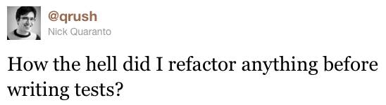
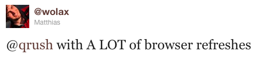

!SLIDE

# The Culture of Testing
## Jon Yurek
## thoughtbot, inc.
## RubyEnRails 2010

!SLIDE

# Your Narrator
## CTO and Founder of thoughtbot, inc.
## Boston, MA
## Founded in 2003

!SLIDE

# ... and didn't test.

!SLIDE

# Oh, we test now, sure.
## Everyone starts somewhere.

!SLIDE

# Who was taught testing in school?
# Who was taught version control in school?
# &nbsp;
## We sure weren't.

!SLIDE

# We didn't have any arguments against it yet.
## It wasn't a thing to be argued against.
## We just didn't do it.

!SLIDE

# We were hackers. Explorers. Tinkerers.

!SLIDE

# We found Rails and decided to make a big jump.
## Not just _to_ Rails, but _away_ from hackery.

!SLIDE

# We got into testing because we got into Ruby and Rails
## The testing culture of the community really pushed us.

!SLIDE

# It used to be that your Rails coming of age was a blog.

!SLIDE

# Then it beame a testing framework.

!SLIDE

# We have *so many* testing tools and utilities.

!SLIDE

# test/unit
# RSpec
# Shoulda
# minitest
# bacon
# cucumber
# steak
# test/spec

!SLIDE

# factory_girl
# machinist
# fixture scenarios
# mocha
# sham-rack
# capybara
# _and a whole lot more_

!SLIDE

# Because of this, we started testing.

!SLIDE

# We've become pretty big proponents of TDD.

!SLIDE

# We've put out quite a bit of testing code as OSS.
## We really believe in this.
## We want others to, too.

!SLIDE

# We started with what Rails gave us.

!SLIDE

# Unit tests.
## They work, but they're limited.

!SLIDE

# Functional tests.
## Well, Rails' functional tests are more like small integration tests.

!SLIDE

# We got good coverage on our code.

!SLIDE

# Then we found cucumber.

!SLIDE

# What? Plain text?
## I had a lot of reservations, especially when it was the "RSpec story runner".

!SLIDE

# Ok, I hated it, and the idea.
## I came around.

!SLIDE

# Rails Rumble 2009
## Nothing but cucumber, even the git parts.

!SLIDE

# Since then, mostly cucumber.
## Unit and functional where needed.

!SLIDE

# We're big on fakes now.
## Sham-rack, endpoints that act like the real thing.

!SLIDE

# In fact, we had a nice internal presentation last week.
## Demonstrated lots of testing.

!SLIDE

# Ok, so that's how we test.

!SLIDE

# There are a _lot_ of places that don't test.
## No, a _lot_.

!SLIDE

# There's a pretty good chance you're working for one.

!SLIDE

# A lot of talks at a lot of conferences are about testing.
## (Including this one)

!SLIDE

# Paperclip has 2796 GitHub watchers.
## Still clinging to the top 10.

!SLIDE

# RSpec has 1600.
## Shoulda's not even on the list.

!SLIDE

# So how do we introduce testing to hostile environments?

!SLIDE

# Same way as version control.
## Yeah, some places don't use version control.

!SLIDE

# How to fix it? Just use it.

!SLIDE

# Hire other people who test.
## It helps if you have authority or are in on interviews.

!SLIDE

# But there's a hidden detail...

!SLIDE

# You're all testing.
## Just not efficiently.

!SLIDE

# Even big companies with waterfall methodologies have QA Departments.

!SLIDE

# A QA department is just a really inefficient test.
## So from here on, "testing" means "automated testing"

!SLIDE

# We made computers to do the boring stuff for us.

!SLIDE

# It's a hard sell against people who like the QA department.
## (No offense to QA people in the audience)

!SLIDE

# Automated tests are that boring stuff.
## Checking our i's are dotted and t's crossed.

!SLIDE

# QA doesn't save money.
## It shifts it around.

!SLIDE

# Technical Debt buildup and poor feedback loops.

!SLIDE

# We're all scientists.
## We're in Computer Science.
## We use the scientific method.

!SLIDE

# Start with a hypothesis.

!SLIDE

# Come up with a test to prove or disprove it.

!SLIDE

# Run it with a control.

!SLIDE

# Determine Results.

!SLIDE

# ... Profit!

!SLIDE

# The hypothesis states your problem. Even "I should be able to log in."
## Doesn't sound very exciting, saying it like that.

!SLIDE

# "The greatest challenge to any thinker is stating the problem in a way that will allow a solution." - Bertrand Russell

!SLIDE

# Writing the tests explicitly states a solvable problem and its confirmation.
## This is harder than writing the solution.

!SLIDE

# Running it with a control means watching it fail.
## It's important to know your tests are doing what they say.
## You're testing your tests this way.

!SLIDE

# Make it green, and you have your result.
## If you can't, rethink your test.

!SLIDE

# All of this is done the same way whether your automate or not.
## Browser tests are still tests.
## QA, too. They're just bad for quick feedback.

!SLIDE

# We need to make code better.

!SLIDE

!SLIDE

!SLIDE

!SLIDE

# Testing is how we refactor.

!SLIDE

# Refactoring is how we make code better.

!SLIDE

# We owe it to ourselves and our profession to promote testing.

!SLIDE

# If not for correctness, then to save your Refresh button.

!SLIDE

# Come up witb crazy ideas.

!SLIDE

# Crazy ideas like running Javascript in Ruby.
## Well, it exists, but...

!SLIDE

# Crazy ideas like automated HTML/CSS tests.

!SLIDE

# We need a CPAN tester network.
## Distributed CI network.

!SLIDE

# Projects without tests need public shaming.

!SLIDE

# We _don't_ use plugins and gems without tests.
## We'll write tests for them if we have to.

!SLIDE

# GitHub pull requests are fantastic.

!SLIDE

# Distributed, redundant CI network to make tests visible would be more fantastic.

!SLIDE

# Put them together and you have a very public avenue to better software.

!SLIDE

# We have the tools, we have the technology.

!SLIDE

# We talk about testing a lot more than we test, it seems.

!SLIDE

# The culture made it visible, made some people care.

!SLIDE

# Testing, even just in our community has grown.

!SLIDE

# We can keep it growing.

!SLIDE

# Professionals test.

!SLIDE

# Thank You.

!SLIDE

# Questions?
# &nbsp;
# Jon Yurek
# http://robots.thoughtbot.com
# @jyurek
